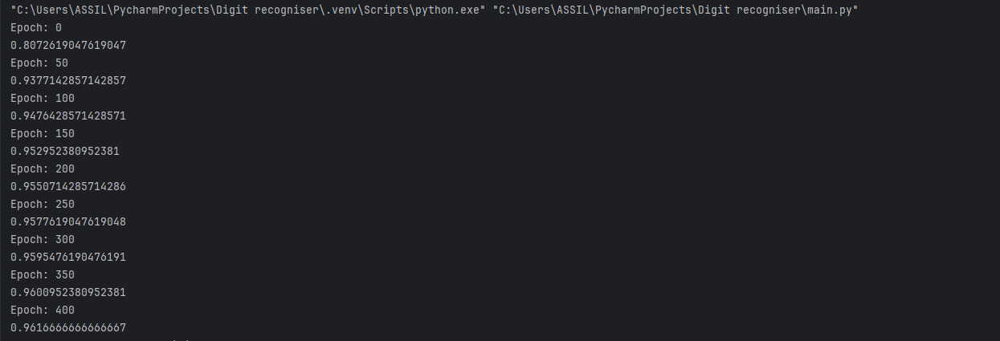
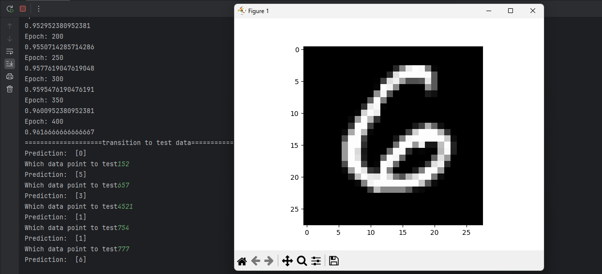

# Handwritten Digit Classifier (Neural Network from Scratch)

This project implements a **two-layer neural network from scratch using NumPy** to classify handwritten digits (0–9).
It is trained on image pixel data and uses **stochastic gradient descent**, **ReLU**, and **softmax** — no deep-learning libraries involved.

The dataset used is the [Digit Recognizer](https://www.kaggle.com/competitions/digit-recognizer) dataset on Kaggle.

---

## Features

* Fully implemented neural network using only NumPy
* One hidden layer with ReLU activation
* Softmax output layer for multiclass classification
* He weight initialization
* Mini-batch stochastic gradient descent
* Accuracy tracking during training
* Visualization of test predictions using Matplotlib

---

## Dataset Requirements

You must provide two CSV files:

### `train.csv`

* Shape: `(number_of_samples, 785)`
* Column 0: labels (digits 0–9)
* Columns 1–784: pixel values (28×28 grayscale images)

### `test.csv`

* Shape: `(number_of_samples, 784)`
* Contains only pixel values (no labels)

Pixel values should range from **0 to 255** (the program normalizes them automatically).

---

## Neural Network Architecture

```
Input Layer:    784 neurons (28×28 pixels)
Hidden Layer:   10 neurons (ReLU)
Output Layer:   10 neurons (Softmax)
```

---

## How It Works

1. **Data preprocessing**

   * CSV files are loaded using Pandas
   * Pixel values are normalized to `[0, 1]`
   * Labels are one-hot encoded

2. **Forward propagation**

   * Linear → ReLU → Linear → Softmax

3. **Backward propagation**

   * Cross-entropy gradient via softmax output
   * Gradients computed manually

4. **Optimization**

   * Mini-batch stochastic gradient descent
   * Learning rate: `0.01`
   * Batch size: `64`
   * Training epochs: `400`

---

## Training the Model

During training, the model prints accuracy every **50 epochs**.

Example output:

```
Epoch: 0
0.11
Epoch: 50
0.82
Epoch: 100
0.90
```

---

## Results & Performance

On my local machine, the network achieves approximately **95% training accuracy** after 400 epochs.

This accuracy is measured **on the training dataset itself** (no separate validation set). The goal is to demonstrate that the network is learning effectively rather than to optimize benchmark or leaderboard performance.

Training was performed on CPU only.

### Training Accuracy Output

The following screenshot shows the accuracy printed during training:



### Example Predictions

Below is an example of a handwritten digit from the test set along with the model’s predicted label:



---

## Testing & Visualization

After training completes, the program switches to test mode.

You will be prompted to enter an index from the test dataset:

```
Which data point to test
```

* The model prints the predicted digit
* The corresponding image is displayed using Matplotlib

You can enter different indices repeatedly to visualize multiple predictions.

---

## Key Functions

* `stochastic_gradient_descent()` – trains the neural network
* `propagation()` – forward pass
* `back_prop()` – backpropagation
* `make_predictions()` – predicts labels for new data
* `test_prediction()` – visualizes predictions

---

## Dependencies

Make sure you have the following installed:

```bash
pip install numpy pandas matplotlib
```

---

## Notes

* This project is intended for **learning and experimentation**
* No frameworks like TensorFlow or PyTorch are used
* Accuracy depends on training time and learning rate
* Code is easy to extend (more layers, different activations, etc.)

---

## Example Use Case

Perfect for:

* Understanding neural networks from first principles
* Deep learning coursework
* Practicing NumPy-based implementations
* Visualizing how digit classifiers work
